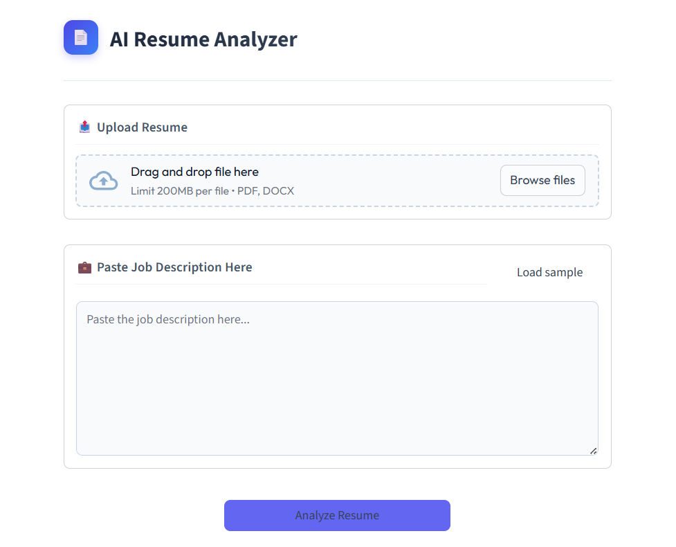

# AI ATS Resume Analyzer
An AI tool to compare your resume against a job description and give you an ATS match score.

## Description
This is a resume analyzer built to see how well a resume stacks up against a specific job description. It basically reads your resume, compares it against the job you want, and gives you an ATS score. It also picks out the skills you have and tells you what you're missing, which is super handy for tweaking your resume before actually applying somewhere.

## Features
- Reads your resume, whether it's a PDF or DOCX file
- Calculates an ATS match score based on what the job actually asks for
- Pulls out your specific skills using some basic NLP techniques
- Tells you exactly what skills to add to improve your chances
- Has a really clean, straightforward web interface

## Tech Stack
- Python
- NLP (using NLTK)
- Scikit-Learn
- Streamlit (handles the web interface)
- Custom CSS for styling

## Project Structure
AI_ResumeAnalyzer/
│── app.py                 # The main Streamlit web app
│── resume_parser.py       # Code to read text from PDFs and DOCX files
│── text_preprocessing.py  # Cleans up the text before processing
│── skills.py              # Figures out which skills match
│── styles.css             # Makes the app look nice with a clean theme
│── sample_resumes/        # Folder with some test resumes
│── requirements.txt       # List of libraries you need to install
│── README.md              # This file right here

## How to Run

1. Clone the repository
```bash
git clone https://github.com/Ushasri-Dasari/AI-Ats-Resume-Analyzer.git
```

2. Go into the project folder
```bash
cd AI-Ats-Resume-Analyzer
```

3. Install the required libraries
```bash
pip install -r requirements.txt
```

4. Start the app
```bash
streamlit run app.py
```

## Screenshots



## Future Improvements
- Add a system that recommends jobs directly to you
- Try out deep learning to make the skill matching even more accurate
- Get it hosted online so people don't have to download the code to use it

## Author
Ushasri Dasari
